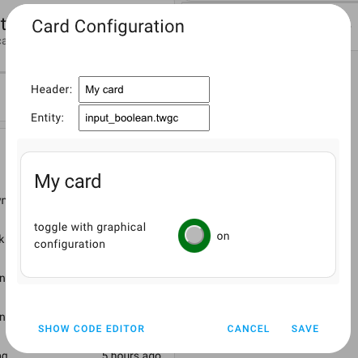

[](https://github.com/hacs/integration)

# Toggle Card to HACS



Bringing the toggle card to HACS

***

* @published: May 2023
* @author: Elmar Hinz
* @workspace: `conf/www/tutor`
* @name: `toggle-card-to-hacs`
* @id: `tcth`

You learn:

* how to layout the Github repository for a custom HACS card

## Goal

The of this tutorial is to bring you card to HACS by preparing a repository on
Github according to the requirements of HACS. It will be a custom repository.
We don't register it as a default repositroy.

This README serves as the README required by HACS at the same time.

## Prerequisites

* tutorial 06: toggle with graphical configuration
* you have an account on github
* you know how to register `card.js` as a resource
* you know how to create the helper entity of type boolean aka toggle
* you know how to add and edit a card
* you know how to reload `card.js` and dashboard after editing

In doubt revisit tutorial 02 and 04.

## Setup

Take the same steps as in the previous tutorial. Name the helper entity
`tcth` this time.

## The code

The code is the same as in the previous tutorial. All names and ids have been
adjusted.

## HACS

The requirements of HACS are [documented here](https://hacs.xyz/docs/publish/start).

Some requirements are stored as files into the repository.  Other requirements
like *description*, *topics* and *version* are edited with the tools of your
github repository.

### hacs.json

This is the configuration file of the HACS repository.

```js
{
    "name": "Simple Toggle Card",
    "render_readme": true,
    "filename": "card.js"
    "content_in_root": true
  }
```

The `name` is the minimal requirement of HACS. It is displayed in the frontend.
`render_readme` tells HACS to render the README.md file instead of info.md.
`filename` is the name of the cards file we want to ship.

`content_in_root` informs HACS not to expect a `dist/` directory.
If you run a toolchain to generate from a `src/` directory you will
likely use a `dist/` directory which is the default location.

### README.md

The README by chance is the file containing this turial. HACS points to
[this address] (https://github.com/matiassingers/awesome-readme) for suggestions
how to do a good README.

### Badge

A badge advertises the repository as a HACS repository. The code string is given
on the page with the documentation.

```js
[](https://github.com/hacs/integration)
```
